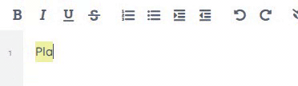

 

# Make Bold et al sticky :) 
Apply Bold/Italic/Underline with a click/control B keyboard command then type.
This is useful if you are used to hitting control b and typing and expecting that text to be bold.
With `ep_align` installed, the chosen alignment now also sticks across new lines until you change it again.

## How it works

## Installing
npm install ep_sticky_attributes

or Use the Etherpad ``/admin`` interface.

## Testing

### Frontend

Visit http://whatever/tests/frontend/ to run the frontend tests.

### backend

Type ``cd src && npx cross-env NODE_ENV=production mocha --import=tsx --timeout 120000 --recursive node_modules/ep_*/static/tests/backend/specs/**`` to run the backend tests.

## LICENSE
Apache 2.0
